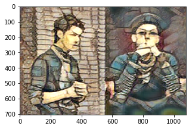
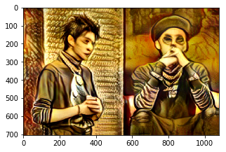

# 先贴效果 DS-sand painting 
**Style:**


**Output：**


# 1 背景介绍

## 1.1 使用说明：
若只是想把图片变为沙画效果，直接调到“**4模型使用**” 即可。若要细纠迁移训练过程，可继续阅读。

Aistudio项目地址：[https://aistudio.baidu.com/aistudio/projectdetail/2012947](https://aistudio.baidu.com/aistudio/projectdetail/2012947)

## 1.2 DS -- Deepshop：
1.在图像编辑中有大名鼎鼎的photoshop作为图像处理工具，那在这里我打算也弄个Deepshop作为图像处理的深度工具箱，开箱即用。

2.后续也会陆续整理其他工具，先整理了沙画工具的

3.至2021年6月，这个模型基于msgnet迁移训练，效果离以假乱真还有点距离，效果还可以继续优化，stylepro_artistic那个迁移可能效果更好，可惜暂时没找到那个可以迁移的，有时间看从头训练一个。


## 1.3 沙画：

1.近几年开始流行，用一个底部可照亮的白色或透明的胶硬板，然后把细小的沙子撒在上面，用手在上面作画。（与我们在浴室粘满雾气的玻璃上画画类似）但由于作画者的手法和那沙子与底部亮光形成的独特影像，所以有一种奇妙的视觉效果。

2.这里先实现把图片转为成品的沙画，后面有时间再弄成整个沙画作画的视频。

## 1.4 图像迁移：

1. 考虑到实现沙画效果，最简单就是图像迁移

2、早在2016年深度学习就有style transfer，把抽象油画迁移到图片，效果很不错，后续有把颜色光照/颜色等迁移的Deep Photo Style Transfer 效果更是amazing ：

[https://www.paperswithcode.com/paper/deep-photo-style-transfer](http://https://www.paperswithcode.com/paper/deep-photo-style-transfer)


3、把普通图片转成沙画，一开始尝试用paddlehub的msgnet及stylepro_artistic来直接把沙画图片作为style生成，效果还是强差人意。stylepro_artistic要好一些，但可能训练该模型的抽象画还是很多折来折去的线条生成的沙画颜色与线条都有些少差距。所以，使用paddlehub迁移学习

3、 stylepro_artistic 没预留finetune的接口，msgnet有官方的迁移的几行代码，在上面修改测试。后续基于stylepro_artistic从头训练看看。（吐槽paddlehub的finetune方式还是比较杂乱的，各个模型都不同）

# 2 准备作style的沙画图片,下载minicoco作迁移训练数据

## 2.1.解压我搜集的90多张沙画的数据集


1. 沙画没有批量的下载，只能逐个找，要找多就不好找

2. 官方msgnet的finetuen例子是把二十多张style image都丢到一个文件夹训练

3. 我实际训练发现，其实只要一张更好收敛，可能是搜集的沙画色调，颜色等还是有不少差异，或者模型的能力还是偏弱,最终还是推荐训练选用一张作为沙画style的代表。


## 2.2. 清洗图片，按Paddlepaddle2.0 的格式 建立dataset


### 2.2.1. 过滤图片

参考官方用minicoco训练msgnet，minicoco及我沙画的有些图片打开会有问题，需要过滤。用图片集的以后都要备好图片过滤工具

### 2.2.2. 归一化

看到msgnet训练代码预处理好像没用normalize， 所以我迁移时也没用

### 2.2.3 style图片数量

我测试单张图片loss降得较快，多张较慢所以用了单张图2015.jpg作style，而不是整个shahua2文件夹中的所有沙画图片。若要整个文件夹训练而不是指定某张图片，把styleImg=None 即可


```python

import os
from typing import Callable
import cv2
import paddle
import paddlehub as hub
import numpy as np
import paddlehub.vision.transforms as T
import paddlehub.env as hubenv
from paddlehub.vision.utils import get_img_file
#from paddlehub.utils.download import download_data
import os
def clearNullPic(path,transform):
    pathList=get_img_file(path)
    for pp in pathList:
        try:
            img=transform(pp)
            img=img.astype('float32')
            if len(img)>0:continue
        except:
            pass
        print('remove',pp)
        os.remove(pp)
def filesInFolder(rootdir,fileType=['.jpg','.png','.bmp','.JPG']):
    pathList=[]
    nameList=[]
    filelist = os.listdir(rootdir) #列出文件夹下所有的目录与文件
    for i in range(len(filelist)):
        if filelist[i][-4:] in fileType:
            pathList.append(os.path.join(rootdir,filelist[i]))
            nameList.append(filelist[i])
    return pathList,nameList

class MyMiniCOCO(paddle.io.Dataset):
    """
    Dataset for Style transfer. The dataset contains 2001 images for training set and 200 images for testing set.
    They are derived form COCO2014. Meanwhile, it contains 21 different style pictures in file "21styles".
    Args:
       transform(callmethod) : The method of preprocess images.
       mode(str): The mode for preparing dataset.
    Returns:
        DataSet: An iterable object for data iterating
    """

    def __init__(self, transform: Callable, mode: str = 'train',
    data1path='/home/aistudio/data',styleFolder='shahua',styleImg=None):
        self.mode = mode
        self.transform = transform

        if self.mode == 'train':
            self.file = 'train'
        elif self.mode == 'test':
            self.file = 'test'
        if styleImg:
            self.style_file =os.path.join(data1path,  styleFolder,styleImg)
            self.style=[self.style_file]
        else:        
            self.style_file =os.path.join(data1path,  styleFolder)
            self.style = get_img_file(self.style_file)

        self.file = os.path.join(data1path, 'minicoco', self.file)
        self.data = get_img_file(self.file)
        
        assert (len(self.style)>0 and len(self.data)>0)
        print('self.data',len(self.data))
        print('self.style',len(self.style))
    def getImg(self,group,idx):
        im=[]
        ii=idx
        while len(im)==0:
            try:
                
                im = self.transform(group[ii])
            except :
                
                print('v',len(group),ii)
            ii-=1
        return im
    def __getitem__(self, idx: int) -> np.ndarray:

        im = self.getImg(self.data,idx)

        
        im = im.astype('float32')
        style_idx = idx % len(self.style)
        style = self.getImg(self.style,style_idx)
        style = style.astype('float32')
        return im, style

    def __len__(self):
        return len(self.data)

transform = T.Compose([T.Resize((256, 256), interpolation='LINEAR')])
#msgnet 看到训练代码没用normalize 所以我迁移时也没用
#transform = T.Compose([T.Resize((256, 256), interpolation='LINEAR'),T.Normalize()])
dirpath='data/minicoco/test'
#clearNullPic(dirpath,transform)
dirpath='data/minicoco/train'

#clearNullPic(dirpath,transform)
styledata = MyMiniCOCO(transform,mode='train',data1path='/home/aistudio/data',styleFolder='shahua2',styleImg='2015.jpg')
## 打印出来测试
print(styledata.__getitem__(0))
```

# 3. 训练

## 3.1 载入modelhub的msgnet 预训练模型 或  自己训练到一半的模型

```
model = hub.Module(name='msgnet',load_checkpoint=checkpoint)
```

1. 若需要载入paddlehub已训练的checkpoint开始迁移则 load_checkpoint=None，否则指定自己想要从哪个模型开始训练，给出该模型的地址。

2. 下面代码训练一段时间后，想重新继续训练，设置goOnTrain=True


## 3.2. 训练的参数——backbone部分要stop_gradient（重要）:

1. 官方直接全部参数都参与训练[https://aistudio.baidu.com/aistudio/projectdetail/1238778?channelType=0&channel=0](https://aistudio.baidu.com/aistudio/projectdetail/1238778?channelType=0&channel=0) ，但我们其实知道backbone部分其实不需要迁移，有可能影响迁移效果。在这里，我实测发现不要全部参数都训练，不然10几个epoch后，得到只有一张大部分是黑色的图

2. 基于1所述，下载paddle.vision中的vgg16，打印看看他有26组参数，所以设置**msgnet的第25个之前的参数stop_gradient=True**

3. 使用32G的显卡来训练，batch size尽量大，好像基于32G的显存32已是几乎最大了。

4. 训练100个epoch，效果最好，尽管看曲线100以后还能减少，但看实际图100就不错了。

## 3.3 训练情况:

1. 因本身模型训练可能拿油画或抽象画来训练，很容易生成很多线条，同时msgnet这个会生成很多圆孔。

2. 经过100epoch的训练，基本loss降得较慢了，我就没继续了。下图从左上到右下分别是 15 epoch，35 epoch，75 epoch，100 epoch的效果。条纹与圆孔逐渐减少/减淡。


3.没用paddlehub trainer中的eval,好像会报错，但所有checkpoint保存到test_style_ckpt中，可转换成model来查看训练过程的变化


## 3.4  使用visualDL查看训练过程（已熟悉的请忽略）:

在aistudio上运行可用左侧工具栏的可视化，设置logdir为test_style_ckpt/visualization,然后运行visualDL,打开VisualDL即可在新窗口看到loss逐渐减少的过程，下图为训练过程截图：


```python
import paddle
import paddlehub as hub
from paddle.vision.models import vgg16
from paddlehub.finetune.trainer import Trainer
#from paddlehub.datasets.minicoco import MiniCOCO
import paddlehub.vision.transforms as T
paddle.set_device("gpu:0")
%cd /home/aistudio/
# backbone model
backbone = vgg16(pretrained=True,num_classes=-1)
print('vgg parameters nums:',len(list(backbone.named_parameters())))
del backbone
##
trainFlag=True
goOnTrain=True
##
if trainFlag:
    if not goOnTrain:
        checkpoint=None
    else:
        checkpoint='/home/aistudio/model/msgnet/style_paddle.pdparams'
    model = hub.Module(name='msgnet',load_checkpoint=checkpoint)
    
    print(type(model),' parameters nums:',len(model.parameters()))
    ##
    for index,param in enumerate(model.parameters()):
        #print(param.name)        
        if index>25:
            param.stop_gradient=False
        else:
            param.stop_gradient=True

    #print( model.summary())
    print('model.parameters()',len(model.parameters()))
    #print('model.parameters()',model.parameters())
    optimizer = paddle.optimizer.Adam(learning_rate=0.0001, parameters=model.parameters())
    trainer = Trainer(model, optimizer,use_gpu=True,use_vdl=True, checkpoint_dir='test_style_ckpt')
    trainer.train(styledata, epochs=65, batch_size=32, eval_dataset=None, log_interval=10, save_interval=1)
```

    /home/aistudio
    vgg parameters nums: 26
    load custom checkpoint success
    <class 'msgnet.module.MSGNet'>  parameters nums: 137
    model.parameters() 137


    [2021-06-13 20:02:37,168] [ WARNING] - PaddleHub model checkpoint not found, start from scratch...


    load pretrained vgg16 checkpoint success


    [2021-06-13 20:02:53,983] [   TRAIN] - Epoch=1/65, Step=10/63 loss=350263.6437 content gap=268970.7500 style gap=81292.9219 lr=0.000100 step/sec=0.59 | ETA 01:54:43
    [2021-06-13 20:03:10,852] [   TRAIN] - Epoch=1/65, Step=20/63 loss=351000.2281 content gap=271881.1875 style gap=79119.0391 lr=0.000100 step/sec=0.59 | ETA 01:54:55
    [2021-06-13 20:03:27,714] [   TRAIN] - Epoch=1/65, Step=30/63 loss=350735.5344 content gap=270516.5000 style gap=80219.0234 lr=0.000100 step/sec=0.59 | ETA 01:54:58
    [2021-06-13 20:03:44,557] [   TRAIN] - Epoch=1/65, Step=40/63 loss=352877.9688 content gap=271122.5938 style gap=81755.3750 lr=0.000100 step/sec=0.59 | ETA 01:54:58
    [2021-06-13 20:04:01,465] [   TRAIN] - Epoch=1/65, Step=50/63 loss=348963.5469 content gap=269543.0000 style gap=79420.5781 lr=0.000100 step/sec=0.59 | ETA 01:55:03
    [2021-06-13 20:04:18,349] [   TRAIN] - Epoch=1/65, Step=60/63 loss=353431.1594 content gap=274053.2500 style gap=79377.9219 lr=0.000100 step/sec=0.59 | ETA 01:55:05
    [2021-06-13 20:04:22,600] [    INFO] - Saving model checkpoint to test_style_ckpt/epoch_1
    [2021-06-13 20:04:40,683] [   TRAIN] - Epoch=2/65, Step=10/63 loss=347909.7094 content gap=269116.5625 style gap=78793.1719 lr=0.000100 step/sec=0.58 | ETA 01:55:28
    [2021-06-13 20:04:57,552] [   TRAIN] - Epoch=2/65, Step=20/63 loss=347812.5000 content gap=268838.2188 style gap=78974.2891 lr=0.000100 step/sec=0.59 | ETA 01:55:25
    [2021-06-13 20:05:14,452] [   TRAIN] - Epoch=2/65, Step=30/63 loss=347105.6437 content gap=267965.3750 style gap=79140.2500 lr=0.000100 step/sec=0.59 | ETA 01:55:25
    [2021-06-13 20:05:31,291] [   TRAIN] - Epoch=2/65, Step=40/63 loss=352533.6906 content gap=270811.4375 style gap=81722.2656 lr=0.000100 step/sec=0.59 | ETA 01:55:22
    [2021-06-13 20:05:48,157] [   TRAIN] - Epoch=2/65, Step=50/63 loss=352925.0500 content gap=273140.3125 style gap=79784.7344 lr=0.000100 step/sec=0.59 | ETA 01:55:21
    [2021-06-13 20:06:05,037] [   TRAIN] - Epoch=2/65, Step=60/63 loss=351949.1312 content gap=273303.1250 style gap=78646.0469 lr=0.000100 step/sec=0.59 | ETA 01:55:20
    [2021-06-13 20:06:09,291] [    INFO] - Saving model checkpoint to test_style_ckpt/epoch_2

    。。。。。

    [2021-06-13 21:52:32,970] [   TRAIN] - Epoch=64/65, Step=10/63 loss=318282.6562 content gap=252053.8281 style gap=66228.8125 lr=0.000100 step/sec=0.60 | ETA 01:53:08
    [2021-06-13 21:52:49,436] [   TRAIN] - Epoch=64/65, Step=20/63 loss=317469.0656 content gap=251675.4219 style gap=65793.6484 lr=0.000100 step/sec=0.61 | ETA 01:53:07
    [2021-06-13 21:53:05,836] [   TRAIN] - Epoch=64/65, Step=30/63 loss=316029.2188 content gap=250397.7188 style gap=65631.4922 lr=0.000100 step/sec=0.61 | ETA 01:53:07
    [2021-06-13 21:53:22,232] [   TRAIN] - Epoch=64/65, Step=40/63 loss=314111.1594 content gap=247956.5312 style gap=66154.6094 lr=0.000100 step/sec=0.61 | ETA 01:53:07
    [2021-06-13 21:53:38,599] [   TRAIN] - Epoch=64/65, Step=50/63 loss=318275.1250 content gap=252197.0781 style gap=66078.0156 lr=0.000100 step/sec=0.61 | ETA 01:53:07
    [2021-06-13 21:53:55,006] [   TRAIN] - Epoch=64/65, Step=60/63 loss=313228.8875 content gap=248153.9219 style gap=65074.9883 lr=0.000100 step/sec=0.61 | ETA 01:53:07
    [2021-06-13 21:53:59,134] [    INFO] - Saving model checkpoint to test_style_ckpt/epoch_64
    [2021-06-13 21:54:16,709] [   TRAIN] - Epoch=65/65, Step=10/63 loss=316810.6094 content gap=250865.5781 style gap=65945.0547 lr=0.000100 step/sec=0.60 | ETA 01:53:07
    [2021-06-13 21:54:33,204] [   TRAIN] - Epoch=65/65, Step=20/63 loss=315368.6344 content gap=249741.3438 style gap=65627.2656 lr=0.000100 step/sec=0.61 | ETA 01:53:07
    [2021-06-13 21:54:49,602] [   TRAIN] - Epoch=65/65, Step=30/63 loss=319209.0906 content gap=252459.0938 style gap=66749.9766 lr=0.000100 step/sec=0.61 | ETA 01:53:07
    [2021-06-13 21:55:06,042] [   TRAIN] - Epoch=65/65, Step=40/63 loss=315296.6500 content gap=249270.5000 style gap=66026.1406 lr=0.000100 step/sec=0.61 | ETA 01:53:06
    [2021-06-13 21:55:22,490] [   TRAIN] - Epoch=65/65, Step=50/63 loss=315085.6719 content gap=249401.8281 style gap=65683.8203 lr=0.000100 step/sec=0.61 | ETA 01:53:06
    [2021-06-13 21:55:38,901] [   TRAIN] - Epoch=65/65, Step=60/63 loss=315485.1781 content gap=250599.9062 style gap=64885.2930 lr=0.000100 step/sec=0.61 | ETA 01:53:06
    [2021-06-13 21:55:43,015] [    INFO] - Saving model checkpoint to test_style_ckpt/epoch_65


# 4.模型的使用

## 4.1 把训练checkpoint保存为param及pdot的模型

通过修改 !cp -r test_style_ckpt/epoch_100/* /home/aistudio/model/msgnet/  指定你需要转为模型的是第几个epoch（这里是第100个epoch）

PS:吐槽paddlehub不同模型不同的保存方法，只能追进去源码来看


```python
def epochModel4Use():
    !mkdir /home/aistudio/model
    !rm -rf /home/aistudio/model/msgnet
    !mkdir /home/aistudio/model/msgnet
    ## 看需要取哪个epoch生成模型
    !cp -r test_style_ckpt/epoch_100/* /home/aistudio/model/msgnet/
    ##
    !mv /home/aistudio/model/msgnet/model.pdopt  /home/aistudio/model/msgnet/style_paddle.pdopt
    !mv /home/aistudio/model/msgnet/model.pdparams  /home/aistudio/model/msgnet/style_paddle.pdparams
epochModel4Use()
```

    mkdir: cannot create directory ‘/home/aistudio/model’: File exists


## 4.2 测试看看效果

来看看对比效果。分别是训练msgnet 训练100epoch，msgnet原效果，model_stylepro的效果。后两个都有非常明显的条纹。msgnet甚至颜色都不太对（输入灰度图会好一些）


```python
import paddle
import paddlehub as hub
import cv2
import matplotlib.pyplot as plt
%matplotlib inline
paddle.disable_static()
if __name__ == '__main__':
    
    
    outputPath='out.jpg'
    styleImgPath="data/shahua2/2015.jpg"
    testImgPath='test/wuyifan3.jpg'    
    #testImgPath='test/wuyifan1.jpg' 
    #testImgPath='test/aidingbao1.jpg'
    image=cv2.imread(testImgPath)
    inputGray=False
    if inputGray:
        image=cv2.cvtColor(image,cv2.COLOR_BGR2GRAY)
        image=cv2.cvtColor(image,cv2.COLOR_GRAY2BGR)
    ##
    model_stylepro=hub.Module(name='stylepro_artistic')
    result_style=model_stylepro.style_transfer(    
        images=[{
        'content': image,
        'styles': [cv2.imread(styleImgPath)]
    }])
    
    del model_stylepro
    #
    model_ori = hub.Module(name='msgnet')
    result_ori=model_ori.predict([image], style=styleImgPath, visualization=True, save_path ='style_tranfer')
    del model_ori    
    #
    model = hub.Module(directory='model/msgnet')
    result = model.predict([image], style=styleImgPath, visualization=True, save_path ='style_tranfer')
    #由正方形输出拉回原来图像比例
    result[0]=cv2.resize(result[0],(image.shape[1],image.shape[0]),3)
    result_ori[0]=cv2.resize(result_ori[0],(image.shape[1],image.shape[0]),3)
    result_style[0]['data']=cv2.resize(result_style[0]['data'],(image.shape[1],image.shape[0]),3)
    #
    cv2.imwrite(outputPath,result[0])
    plt.figure(figsize=(5,5))
    plt.imshow(result[0][:,:,[2,1,0]])
    plt.show()
    plt.figure(figsize=(5,5))
    plt.imshow(result_ori[0][:,:,[2,1,0]])
    plt.show()
    plt.figure(figsize=(5,5))
    plt.imshow(result_style[0]['data'][:,:,[2,1,0]])
    plt.show()

```

    [2021-06-14 12:11:07,903] [ WARNING] - The _initialize method in HubModule will soon be deprecated, you can use the __init__() to handle the initialization of the object


    load pretrained checkpoint success
    load pretrained checkpoint success








# 5. 参考


paddlehub 官方图像迁移msgnet项目：[https://aistudio.baidu.com/aistudio/projectdetail/1238778?channelType=0&channel=0](https://aistudio.baidu.com/aistudio/projectdetail/1238778?channelType=0&channel=0)

csdn padlehub迁移学习的说明[https://blog.csdn.net/qq_28540443/article/details/105932425](https://blog.csdn.net/qq_28540443/article/details/105932425)


style transfer可能用到的训练集：wikiart dataset [https://github.com/cs-chan/ArtGAN/tree/master/WikiArt%20Dataset](https://github.com/cs-chan/ArtGAN/tree/master/WikiArt%20Dataset)


 
